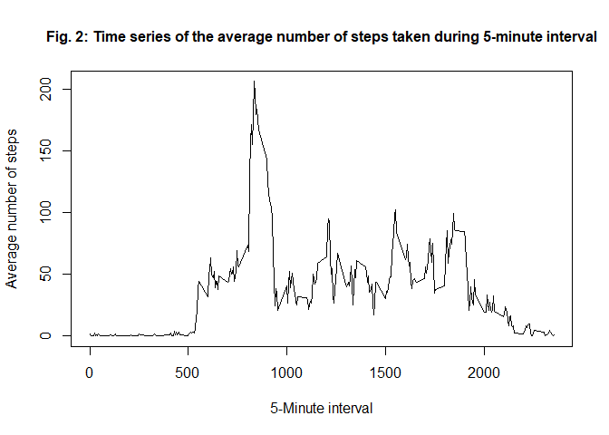
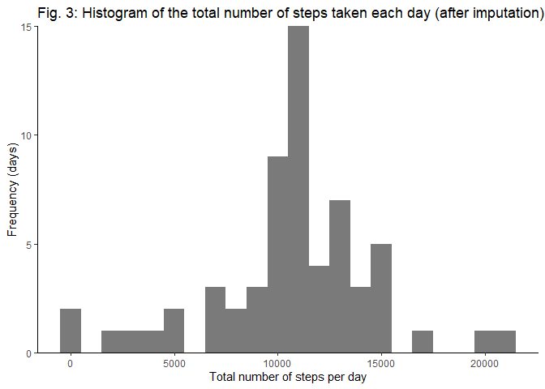
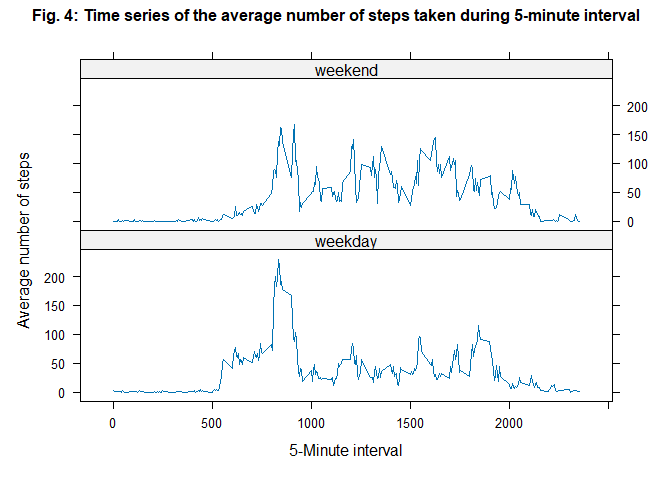

## Loading and pre-processing the data

1.  Load the data (i.e. read.csv()) and the required packages.


```r
# load the data
unzip("activity.zip")
rawData <- read.csv("activity.csv", stringsAsFactors = F)

# load the required packages
library(dplyr)
library(ggplot2)
library(lattice)
```

2.  Process/transform the data (if necessary) into a format suitable for the analysis.


```r
# reformat date object
rawData$date <- as.POSIXct(rawData$date, format = "%Y-%m-%d")
head(rawData)
```

```
##   steps       date interval
## 1    NA 2012-10-01        0
## 2    NA 2012-10-01        5
## 3    NA 2012-10-01       10
## 4    NA 2012-10-01       15
## 5    NA 2012-10-01       20
## 6    NA 2012-10-01       25
```

## What is mean total number of steps taken per day?

For this part of the assignment, the missing values in the data set are ignored.

1.  Calculate the total number of steps taken per day.


```r
# remove the missing values and calculate the total number of daily steps
data1Sum <- group_by(rawData[complete.cases(rawData), ], date) %>%
  summarise(sumSteps = sum(steps, na.rm = T))
head(data1Sum)
```

```
## # A tibble: 6 × 2
##   date                sumSteps
##   <dttm>                 <int>
## 1 2012-10-02 00:00:00      126
## 2 2012-10-03 00:00:00    11352
## 3 2012-10-04 00:00:00    12116
## 4 2012-10-05 00:00:00    13294
## 5 2012-10-06 00:00:00    15420
## 6 2012-10-07 00:00:00    11015
```

2.  Make a histogram of the total number of steps taken each day.


```r
# plot a histogram of the total number of daily steps
ggplot(data1Sum, aes(x = sumSteps)) +
    geom_histogram(binwidth = 1000, alpha=.8) + 
    xlab("Total number of steps per day") +
    ylab("Frequency (days)") +
    labs(title = "Fig. 1: Histogram of the total number of steps taken each day") +
    scale_y_continuous(expand = c(0, 0)) +
    theme_classic()
```

<!-- -->

3.  Calculate and report the mean and median of the total number of steps taken per day


```r
# calculate the mean and median of daily steps
# recall that the NAs were already removed at the beginning of the assignment
cat("Mean of the total number of steps taken per day:", mean(data1Sum$sumSteps)) 
```

```
## Mean of the total number of steps taken per day: 10766.19
```

```r
cat("Median of the total number of steps taken per day:", median(data1Sum$sumSteps))
```

```
## Median of the total number of steps taken per day: 10765
```

## What is the average daily activity pattern?

1.  Make a time series plot (i.e. type = "l") of the 5-minute interval (x-axis) and the average number of steps taken, averaged across all days (y-axis).


```r
# calculate the average number of steps taken for each interval
data2Mean <- group_by(rawData, interval) %>%
    summarise(meanSteps = mean(steps, na.rm = T))
head(data2Mean)
```

```
## # A tibble: 6 × 2
##   interval meanSteps
##      <int>     <dbl>
## 1        0    1.72  
## 2        5    0.340 
## 3       10    0.132 
## 4       15    0.151 
## 5       20    0.0755
## 6       25    2.09
```


```r
# plot the daily activity pattern
plot(x = data2Mean$interval, 
     y = data2Mean$meanSteps, 
     type = "l",
     xlab = "5-Minute interval", 
     ylab = "Average number of steps",
     main = "Fig. 2: Time series of the average number of steps taken during 5-minute interval",
     cex.main = 1)
```

<!-- -->

2.  Which 5-minute interval, on average across all the days in the data set, contains the maximum number of steps?


```r
# calculate the maximum number of steps
cat("The", data2Mean[which.max(data2Mean$meanSteps), ]$interval, "th interval contains the maximum mean number of steps:", data2Mean[which.max(data2Mean$meanSteps), ]$meanSteps)
```

```
## The 835 th interval contains the maximum mean number of steps: 206.1698
```

## Imputing missing values

1.  Calculate and report the total number of missing values in the data set (i.e. the total number of rows with NAs)


```r
# calculate the total number of missing values in each column
sum(is.na(rawData$steps))
```

```
## [1] 2304
```

```r
sum(is.na(rawData$date))
```

```
## [1] 0
```

```r
sum(is.na(rawData$interval))
```

```
## [1] 0
```

```r
cat("There are", sum(is.na(rawData$steps)) + sum(is.na(rawData$date)) + sum(is.na(rawData$interval)), "missing values in the dataset.")
```

```
## There are 2304 missing values in the dataset.
```

2.  Devise a strategy for filling in all of the missing values in the data set. The strategy does not need to be sophisticated. For example, you could use the mean/median for that day, or the mean for that 5-minute interval, etc.


```r
# fill in missing values with the MEAN per interval
data3Imp <- rawData %>% 
    group_by(interval) %>% 
    mutate_at("steps", function(x) ifelse(is.na(x), mean(x, na.rm = TRUE), x))
    # create a new data set that is equal to the original data set but with the missing data filled in
head(data3Imp)
```

```
## # A tibble: 6 × 3
## # Groups:   interval [6]
##    steps date                interval
##    <dbl> <dttm>                 <int>
## 1 1.72   2012-10-01 00:00:00        0
## 2 0.340  2012-10-01 00:00:00        5
## 3 0.132  2012-10-01 00:00:00       10
## 4 0.151  2012-10-01 00:00:00       15
## 5 0.0755 2012-10-01 00:00:00       20
## 6 2.09   2012-10-01 00:00:00       25
```

3.  Create a new data set that is equal to the original data set but with the missing data filled in.

*Please refer to the previous step (see "data3Imp").*

4.  Make a histogram of the total number of steps taken each day.


```r
# calculate the total number of daily steps after imputation
data3ImpSum <- group_by(data3Imp, date) %>% summarise(sumStepsImp = sum(steps))
data3ImpSum$sumStepsImp <- as.integer(data3ImpSum$sumStepsImp) # removes decimals since steps should be integers
head(data3ImpSum)
```

```
## # A tibble: 6 × 2
##   date                sumStepsImp
##   <dttm>                    <int>
## 1 2012-10-01 00:00:00       10766
## 2 2012-10-02 00:00:00         126
## 3 2012-10-03 00:00:00       11352
## 4 2012-10-04 00:00:00       12116
## 5 2012-10-05 00:00:00       13294
## 6 2012-10-06 00:00:00       15420
```


```r
# plot a histogram of the total number of daily steps after imputation
ggplot(data3ImpSum, aes(x = sumStepsImp)) +
    geom_histogram(binwidth = 1000, alpha=.8) + 
    xlab("Total number of steps per day") +
    ylab("Frequency (days)") +
    labs(title = "Fig. 3: Histogram of the total number of steps taken each day (after imputation)") +
    scale_y_continuous(expand = c(0, 0)) +
    theme_classic()
```

<!-- -->

-   Calculate and report the mean and median total number of steps taken per day.


```r
# calculate the mean and median after imputation
cat("Mean of the total number of steps taken per day after filling NAs:", mean(data3ImpSum$sumStepsImp))
```

```
## Mean of the total number of steps taken per day after filling NAs: 10766.16
```

```r
cat("Median of the total number of steps taken per day after filling NAs:", median(data3ImpSum$sumStepsImp)) 
```

```
## Median of the total number of steps taken per day after filling NAs: 10766
```

-   Do these values differ from the estimates from the first part of the assignment? What is the impact of imputing missing data on the estimates of the total daily number of steps?

*There are no significant differences because the MEAN of the non-missing data has been used to impute the missing data.*

## Are there differences in activity patterns between weekdays and weekends?


```r
# prepare the data
data4ImpDay <- data3Imp
```

1.  Create a new factor variable in the data set with two levels -- "weekday" and "weekend" indicating whether a given date is a weekday or weekend day.


```r
# create a new categorical variable with two levels
data4ImpDay$day <- ifelse(as.POSIXlt(data4ImpDay$date)$wday %in% c(1:5), "weekday", "weekend")
head(data4ImpDay)
```

```
## # A tibble: 6 × 4
## # Groups:   interval [6]
##    steps date                interval day    
##    <dbl> <dttm>                 <int> <chr>  
## 1 1.72   2012-10-01 00:00:00        0 weekday
## 2 0.340  2012-10-01 00:00:00        5 weekday
## 3 0.132  2012-10-01 00:00:00       10 weekday
## 4 0.151  2012-10-01 00:00:00       15 weekday
## 5 0.0755 2012-10-01 00:00:00       20 weekday
## 6 2.09   2012-10-01 00:00:00       25 weekday
```

2.  Make a panel plot containing a time series plot (i.e. type = "l") of the 5-minute interval (x-axis) and the average number of steps taken, averaged across all weekday days or weekend days (y-axis). See the README file in the GitHub repository to see an example of what this plot should look like using simulated data.


```r
# calculate the average number of steps taken for each day and interval
data4ImpDayMean <- data4ImpDay %>% 
    group_by(day, interval) %>%
    summarise(meanSteps = mean(steps))
head(data4ImpDayMean)
```

```
## # A tibble: 6 × 3
## # Groups:   day [1]
##   day     interval meanSteps
##   <chr>      <int>     <dbl>
## 1 weekday        0    2.25  
## 2 weekday        5    0.445 
## 3 weekday       10    0.173 
## 4 weekday       15    0.198 
## 5 weekday       20    0.0990
## 6 weekday       25    1.59
```


```r
# panel plot containing a time series of the average activity pattern by type of day
xyplot(meanSteps ~ interval | day, 
       data = data4ImpDayMean,
       type = "l",
       layout = c(1, 2),
       xlab = "5-Minute interval", ylab = "Average number of steps",
       main = list(label = "Fig. 4: Time series of the average number of steps taken during 5-minute interval", cex = 1))
```

<!-- -->
